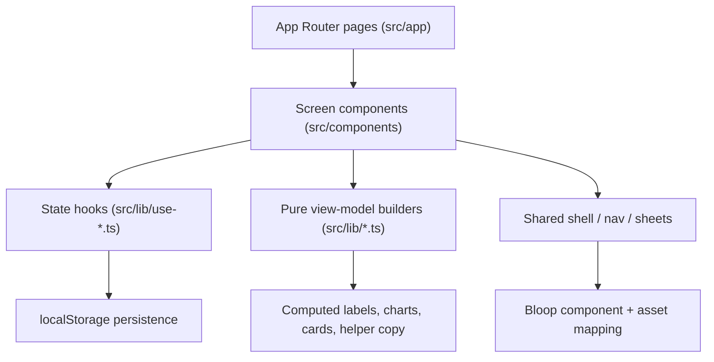

# MyStree Soul

MyStree Soul is a premium mobile-first women’s health companion built with Next.js App Router, React 19, TypeScript, and Tailwind CSS v4. It is designed as a polished product prototype with support flows for cycle tracking, fertility, pregnancy, menopause, and adolescence.

This README is written as an implementation handoff for both human engineers and coding agents. The goal is that an agent can read this file and quickly understand:

- what the app does
- how the routes are organized
- where state lives
- how the UI system is structured
- how Bloop assets work
- which files own which behaviors
- how to extend the app safely without breaking the current system

## Product Summary

MyStree Soul focuses on:

- onboarding a user into the correct life-stage flow
- showing a mobile-first dashboard with contextual support
- letting the user log daily symptoms and support-specific health data
- giving a polished, emotionally supportive UI using the Bloop companion system
- keeping all demo data local for now through browser storage

Current support areas:

- Cycle Tracking
- Fertility Companion
- Pregnancy Support
- Menopause Support
- Adolescence Support

## Core Principles

- Mobile-first layout inside a phone preview shell
- Warm but practical copy
- Reusable screen components rather than logic inside route files
- Local-first state using `useSyncExternalStore` + `localStorage`
- Strong visual consistency through shared nav, drawer, motion, and card patterns
- Bloop is a reusable character system, not ad hoc image placement

## Tech Stack

### Framework

- Next.js 16.2.1
- React 19.2.4
- React DOM 19.2.4

### Language

- TypeScript 5

### Styling

- Tailwind CSS v4
- Global motion and design tokens in `src/app/globals.css`

### Tooling

- ESLint 9
- `eslint-config-next`

### Assets / Processing

- Local Bloop PNG source files in `images/`
- Processed transparent WebP variants in `images/processed/`
- Python asset optimization script in `scripts/optimize_bloop.py`

## Run Commands

```bash
npm install
npm run dev
npm run build
npm run lint
npm run assets:optimize
```

Local app URL:

- `http://localhost:3000`

## High-Level Architecture



## Directory Guide

### `src/app`

Thin route files. Most pages only render a single screen component.

Important routes:

- `/` -> welcome / entry flow
- `/sign-in` -> fake local auth flow
- `/privacy` -> trust and consent screen
- `/onboarding` -> onboarding step 1
- `/onboarding/cycle`
- `/onboarding/goals`
- `/onboarding/questionnaire`
- `/onboarding/summary`
- `/dashboard`
- `/dashboard/cycle`
- `/dashboard/fertility`
- `/dashboard/pregnancy`
- `/dashboard/menopause`
- `/dashboard/adolescence`
- `/dashboard/history`
- `/dashboard/notifications`
- `/settings`
- `/legal/terms`
- `/legal/privacy-standards`

### `src/components`

Owns visual behavior and screen composition.

Important screen components:

- `welcome-screen.tsx`
- `sign-in-screen.tsx`
- `privacy-trust-screen.tsx`
- `onboarding-step-one.tsx`
- `onboarding-cycle-step.tsx`
- `onboarding-step-three.tsx`
- `onboarding-step-four.tsx`
- `onboarding-summary.tsx`
- `dashboard-screen.tsx`
- `cycle-tracker-screen.tsx`
- `fertility-companion-screen.tsx`
- `pregnancy-support-screen.tsx`
- `menopause-support-screen.tsx`
- `adolescence-support-screen.tsx`
- `health-history-screen.tsx`
- `notifications-screen.tsx`
- `settings-screen.tsx`

Shared system components:

- `phone-preview-shell.tsx`
- `sanctuary-bottom-nav.tsx`
- `sanctuary-menu-sheet.tsx`
- `daily-entry-sheet.tsx`
- `fertility-log-sheet.tsx`
- `pregnancy-support-sheet.tsx`
- `adolescence-support-sheet.tsx`
- `auth-session-gate.tsx`
- `dashboard-first-session-tutorial.tsx`

### `src/lib`

Owns state, persistence, and pure business logic.

State hooks:

- `use-auth-session-state.ts`
- `use-onboarding-form-state.ts`
- `use-daily-entry-state.ts`
- `use-fertility-log-state.ts`
- `use-pregnancy-support-state.ts`
- `use-menopause-support-state.ts`
- `use-adolescence-support-state.ts`
- `use-app-settings-state.ts`

Pure helpers / builders:

- `auth-session.ts`
- `onboarding-state.ts`
- `onboarding-questionnaire.ts`
- `cycle-tracker.ts`
- `fertility-companion.ts`
- `pregnancy-support.ts`
- `adolescence-support.ts`

### `src/constants`

- `bloopAssets.ts` -> central typed Bloop asset mapping

### `images`

- original source Bloops: `bloopco1.png` to `bloopco11.png`
- optimized transparent WebPs in `images/processed/`

### `scripts`

- `optimize_bloop.py` -> removes background and outputs optimized WebP Bloop assets

## Route Ownership

The app follows a strict pattern:

1. App route file is tiny
2. Route renders one screen component
3. Screen component composes sections and shared UI
4. Screen component reads data from state hooks
5. Pure builders in `src/lib` produce computed UI data

Example:

- `src/app/dashboard/pregnancy/page.tsx`
- `src/components/pregnancy-support-screen.tsx`
- `src/lib/use-pregnancy-support-state.ts`
- `src/lib/pregnancy-support.ts`

This pattern should be preserved.

## State Model

The project is currently local-first and demo-friendly.

### Persistence Strategy

Most state is stored in `localStorage` and exposed through `useSyncExternalStore`.

Why:

- keeps the prototype fast
- makes the app feel persistent across refreshes
- avoids backend dependency during UI iteration

Important rule:

- snapshot readers must return stable references

This is why stores such as `use-daily-entry-state.ts`, `use-fertility-log-state.ts`, `use-pregnancy-support-state.ts`, `use-menopause-support-state.ts`, and `use-adolescence-support-state.ts` cache the last parsed JSON result.

If you add a new local store, follow this pattern:

1. keep a `lastRaw` cache
2. keep a parsed object cache
3. return the cached object when raw JSON is unchanged
4. bust cache before writes

### Main Stored Domains

#### Auth session

Owned by:

- `src/lib/auth-session.ts`
- `src/lib/use-auth-session-state.ts`

Responsibilities:

- fake sign-in
- fake sign-up
- tutorial seen state
- logout reset

#### Onboarding form

Owned by:

- `src/lib/onboarding-state.ts`
- `src/lib/use-onboarding-form-state.ts`
- `src/lib/onboarding-questionnaire.ts`

Responsibilities:

- user name
- last cycle date
- cycle length
- flow duration
- support area
- questionnaire answers

#### Daily entry

Owned by:

- `src/lib/use-daily-entry-state.ts`
- UI in `src/components/daily-entry-sheet.tsx`

Responsibilities:

- mood
- flow intensity
- symptoms
- pain level
- once-per-day prompt dismissal

#### Fertility log

Owned by:

- `src/lib/use-fertility-log-state.ts`
- `src/components/fertility-log-sheet.tsx`

Responsibilities:

- LH result
- basal temperature
- cervical fluid
- intercourse log

#### Support-specific state

Pregnancy:

- `src/lib/use-pregnancy-support-state.ts`
- hydration
- kick count
- weight
- consult mode
- care plan state

Menopause:

- `src/lib/use-menopause-support-state.ts`
- symptom logs
- intensity
- notes

Adolescence:

- `src/lib/use-adolescence-support-state.ts`
- mood
- ritual progress
- selected ritual
- support helper context

Settings:

- `src/lib/use-app-settings-state.ts`
- appearance
- reminders
- health sync
- biometric lock

## Screen Workflow

### 1. Entry Flow

`/` -> welcome flow

Files:

- `src/app/page.tsx`
- `src/components/welcome-flow.tsx`
- `src/components/welcome-screen.tsx`

Responsibilities:

- introduce product
- route user to sign-in or first-time onboarding

### 2. Sign In / Sign Up

`/sign-in`

Files:

- `src/components/sign-in-screen.tsx`
- `src/lib/auth-session.ts`

Current behavior:

- fake local auth only
- supports returning-user sign in
- supports new-user sign up
- after logout and re-login, first-session tutorial appears again

### 3. Privacy / Trust

`/privacy`

File:

- `src/components/privacy-trust-screen.tsx`

Responsibilities:

- terms acceptance
- privacy messaging
- legal links

### 4. Onboarding

Files:

- `onboarding-step-one.tsx`
- `onboarding-cycle-step.tsx`
- `onboarding-step-three.tsx`
- `onboarding-step-four.tsx`
- `onboarding-summary.tsx`

Flow:

1. basic cycle info
2. cycle mapping
3. support goal selection
4. questionnaire
5. summary / profile view

### 5. Dashboard

`/dashboard`

File:

- `src/components/dashboard-screen.tsx`

Responsibilities:

- contextual hero
- support-aware cards
- quick daily log trigger
- bottom nav / drawer
- first-session tutorial overlay

Important:

- dashboard is support-aware
- pregnancy, menopause, and adolescence should not inherit generic cycle messaging blindly

### 6. Specialized Support Screens

Cycle:

- `src/components/cycle-tracker-screen.tsx`
- uses `src/lib/cycle-tracker.ts`

Fertility:

- `src/components/fertility-companion-screen.tsx`
- uses `src/lib/fertility-companion.ts`

Pregnancy:

- `src/components/pregnancy-support-screen.tsx`
- `src/components/pregnancy-support-sheet.tsx`
- `src/lib/pregnancy-support.ts`

Menopause:

- `src/components/menopause-support-screen.tsx`

Adolescence:

- `src/components/adolescence-support-screen.tsx`
- `src/components/adolescence-support-sheet.tsx`
- `src/lib/adolescence-support.ts`

### 7. History / Notifications / Settings

History:

- `src/components/health-history-screen.tsx`

Notifications:

- `src/components/notifications-screen.tsx`

Settings:

- `src/components/settings-screen.tsx`

## Bloop System

Bloop is implemented as a reusable character system, not as one-off images.

Files:

- `src/constants/bloopAssets.ts`
- `src/components/common/Bloop.tsx`

Semantic state mapping:

- `idle`
- `guide`
- `encourage`
- `reassure`
- `celebrate`
- `inform`
- `empty`
- `alert`
- `adolescence`
- `pregnancy`
- `menopause`

Design rules:

- use Bloop in hero areas, tutorials, empty states, helper sections
- avoid placing Bloop everywhere just for decoration
- keep motion subtle and premium
- above-the-fold Bloop images can be marked as priority when necessary

### Bloop Asset Pipeline

Source:

- `images/bloopco1.png` to `images/bloopco11.png`

Processed output:

- `images/processed/bloopco1.webp` to `images/processed/bloopco11.webp`

Script:

- `python scripts/optimize_bloop.py`

Pipeline behavior:

- removes source background
- exports transparent WebP assets
- keeps optimized assets separate from source files

## UI System

### Layout

All primary screens are rendered inside:

- `src/components/phone-preview-shell.tsx`

This creates:

- a consistent mobile frame
- a safe visual width
- predictable padding and composition for app-like layouts

### Shared Navigation

Bottom nav:

- `src/components/sanctuary-bottom-nav.tsx`

Drawer:

- `src/components/sanctuary-menu-sheet.tsx`

Rules:

- bottom nav is shared across screens
- support tab is dynamic by selected support area
- settings is treated as part of the profile area in bottom-nav active state
- drawer handles app-wide navigation and logout

### Shared Sheets

Bottom sheets are used for focused actions:

- Daily Entry
- Fertility Log
- Pregnancy Support actions
- Adolescence helper actions

Pattern:

- sheet owns temporary UI state
- save commits to local store
- backdrop close should not partially save data

## Design Language

The product visual direction is:

- warm ivory / terracotta / sage palette
- rounded premium cards
- blurred glass surfaces only where useful
- emotionally calm but not overly medical
- mobile-first typography and spacing

### Motion

Motion is implemented mostly in CSS through `src/app/globals.css`.

Patterns used:

- soft bloom drift
- hero float
- subtle badge/halo breathing
- sheet entrance transitions
- tutorial card choreography

Motion rules:

- keep animations slow and low-amplitude
- avoid distracting loops
- preserve readability and tap accuracy

## Current UX Safeguards

Already implemented:

- no blank auth redirect screen
- no auto-opening daily log on dashboard load
- resettable daily-entry sheet
- validation before save in daily entry
- support-aware notifications
- pregnancy-first dashboard prioritization
- menopause screens avoid cycle-day wording
- stable local-store snapshots for major stores

## Data Integrity Notes

Because the app is local-first:

- localStorage is the source of truth
- fake auth is not secure auth
- support data is demo/prototype data, not clinical record storage

This means:

- do not treat current storage as production-grade persistence
- when adding a backend later, keep the current view-model layer and replace the storage adapters first

## How To Extend Safely

If you are a coding agent or new engineer, follow these rules:

### Adding a new screen

1. create a route file in `src/app/.../page.tsx`
2. create a single screen component in `src/components`
3. put computation into `src/lib`, not inline JSX
4. reuse shared nav, menu, and phone shell

### Adding a new local store

1. use `useSyncExternalStore`
2. cache parsed snapshot objects
3. validate parsed JSON
4. dispatch same-tab custom events after writes

### Editing navigation

Always update both:

- `src/components/sanctuary-bottom-nav.tsx`
- `src/components/sanctuary-menu-sheet.tsx`

### Editing support-specific content

Check:

- `dashboard-screen.tsx`
- relevant support screen
- notifications
- history aggregation if logs should appear there

### Editing onboarding

Check:

- onboarding screens
- `use-onboarding-form-state.ts`
- `onboarding-questionnaire.ts`
- summary/profile view
- dashboard support derivation

## Known Limitations

These are not crashes, but they are still product gaps:

- no backend or real auth provider
- no API sync
- no offline sync queue
- no doctor export workflow yet
- no dark mode implementation yet
- still some lint warnings from unused legacy icon helpers inside older screen files

## Verification Commands

Run before pushing:

```bash
npm run build
npm run lint
```

Current expectation:

- build should pass
- lint should pass with warnings only unless unused helpers are cleaned further

## Suggested Onboarding for a Coding Agent

If you are opening this repo for the first time:

1. read this README fully
2. inspect `src/app` to understand routing
3. inspect `src/components/dashboard-screen.tsx`
4. inspect `src/components/sanctuary-bottom-nav.tsx`
5. inspect `src/components/sanctuary-menu-sheet.tsx`
6. inspect `src/lib/use-onboarding-form-state.ts`
7. inspect one support flow end to end:
   - pregnancy route
   - pregnancy screen
   - pregnancy support state
   - pregnancy support model
8. inspect `src/constants/bloopAssets.ts` and `src/components/common/Bloop.tsx`

That sequence gives the clearest view of how the system is assembled.

## Maintainer Notes

This repo is intentionally organized so that UI polish can continue without rewriting the architecture. The safest way to evolve it is:

- keep route files thin
- keep domain computations in `src/lib`
- keep local state stores stable and cached
- keep Bloop semantic and reusable
- keep bottom nav and drawer consistent
- prefer small targeted refinements over broad visual rewrites

That approach is what keeps the product feeling premium without making the prototype fragile.
